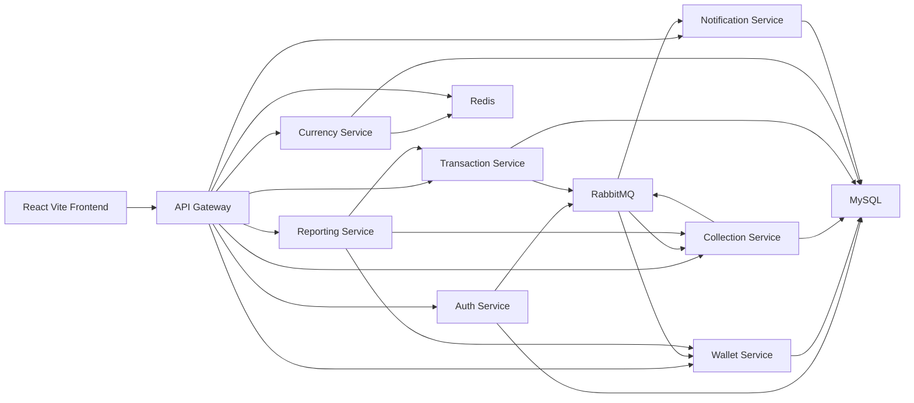

# 06 - System Design And Architecture

## High-Level Architecture

MyPay uses a distributed microservice backend with a mobile-first React frontend.

## Services

### API Gateway

- Single frontend entry point on port 8080.
- Routes `/api/auth`, `/api/wallets`, `/api/accounts`, `/api/collections`, `/api/invitations`, `/api/transactions`, `/api/currency`, `/api/notifications`, and `/api/reports`.
- Validates JWT tokens.
- Injects `X-User-Id`, `X-Trace-Id`, `X-Request-Id`, and `X-Auth-Source`.
- Blocks external access to internal endpoints.
- Applies Redis-backed rate limiting.

### Config Server

- Centralized configuration for all services.
- Allows local and Docker profiles.
- Makes configuration easier to change without scattering settings across services.

### Discovery Server

- Eureka service registry.
- Services can call each other through logical names instead of hard-coded host addresses.

### Auth Service

- Registration, login, refresh, logout, profile update, password change, account deletion.
- Publishes user registration events.
- Generates JWT tokens.
- Stores revoked refresh tokens.

### Wallet Service

- Account creation.
- Multi-currency wallets.
- Credit, debit, top-up, close/open wallet operations.
- Consumes registration events to create user wallet accounts.

### Collection Service

- Collections, members, invitations, expenses, split rules, balances.
- Role-based access via annotation and aspect.
- Split calculation engine.
- Publishes notification events for collection activities.

### Transaction Service

- Top-up and history.
- Individual settlement.
- Net settlement.
- Saga state tracking.
- Compensation on partial failure.
- Publishes settlement notifications.

### Currency Service

- Supported currencies.
- Exchange rates.
- Currency conversion.
- Redis cache, database persistence, external API fallback, hardcoded fallback.

### Notification Service

- Consumes RabbitMQ notification events.
- Stores notification records.
- Supports notification preferences and notification queries.

### Reporting Service

- Aggregates information from wallet, collection, and transaction services.
- Uses parallel calls for dashboard and position reports.
- Provides spending, ledger, position, and collection statement reports.

## Code Design Talking Points

- `common-lib` centralizes shared constants, API response shape, errors, events, request context, and money utilities.
- Domain services are separated by business capability.
- Controllers stay close to HTTP concerns, while services handle business logic.
- Mappers convert entities into DTO responses.
- Repositories isolate persistence.
- Strategy pattern powers split algorithms.
- Saga orchestrators handle multi-service settlement workflows.
- Feign clients connect services cleanly.
- RabbitMQ decouples event producers and consumers.
