# 11 - Database Relationship Map

## Recommended Drawing Method

Use Mermaid `erDiagram` inside markdown.

Why this is the easiest format for this project:

- It is readable even before rendering.
- It can be pasted into GitHub, Mermaid Live Editor, Notion-like tools, and many markdown viewers.
- It handles large ER maps better than screenshots because it remains editable.
- It lets us separate enforced database relationships from soft microservice references.

Important note: MyPay uses separate service-owned schemas. Some relationships are real JPA joins inside one service database, while many cross-service relationships are soft references by ID, such as `user_id`, `currency`, `collection_id`, `transaction_id`, and `share_id`.

## Schemas

MyPay initializes these databases:

- `ewallet_auth_db`
- `ewallet_wallet_db`
- `ewallet_collection_db`
- `ewallet_transaction_db`
- `ewallet_currency_db`
- `ewallet_notification_db`

## Full Database Relationship Diagram

```mermaid
erDiagram
  USER_T {
    CHAR36 user_id PK
    string user_email UK
    string user_phone
    string user_fname
    string user_lname
    string user_nickname
    string user_invitation_code UK
    string user_status
    datetime user_last_login
    datetime user_created
    datetime user_updated
  }

  USER_CREDENTIAL_T {
    CHAR36 ucrd_id PK
    CHAR36 ucrd_user_id UK "soft FK to USER_T.user_id"
    string ucrd_pwd_hash
    datetime ucrd_created
  }

  REVOKED_TOKEN_T {
    CHAR36 rtkn_id PK
    string rtkn_token_hash UK
    CHAR36 rtkn_user_id "soft FK to USER_T.user_id"
    datetime rtkn_expires_at
    datetime rtkn_revoked_at
  }

  USER_LEGACY_T {
    CHAR36 user_id PK
    string user_email
    string user_phone
    string user_fname
    string user_lname
    string user_nickname
    string user_invitation_code
    string user_status
    datetime user_last_login
    datetime user_created
    datetime user_updated
    datetime user_deleted
  }

  USER_CREDENTIAL_LEGACY_T {
    CHAR36 ucrd_id PK
    CHAR36 ucrd_user_id
    string ucrd_pwd_hash
    datetime ucrd_created
    datetime ucrd_deleted
  }

  ACCOUNT_T {
    CHAR36 acct_id PK
    CHAR36 acct_user_id UK "soft FK to USER_T.user_id"
    datetime acct_created
    datetime acct_updated
  }

  WALLET_T {
    CHAR36 wllt_id PK
    CHAR36 wllt_acct_id FK
    CHAR36 wllt_user_id "soft FK to USER_T.user_id"
    CHAR3 wllt_currency "soft FK to CURRENCY_T.curr_code"
    decimal wllt_balance
    string wllt_status
    datetime wllt_created
    datetime wllt_updated
  }

  PAYEE_T {
    CHAR36 paye_id PK
    CHAR36 paye_acct_id "soft FK to ACCOUNT_T.acct_id"
    CHAR36 paye_user_id "soft FK to USER_T.user_id"
    string paye_nickname
    datetime paye_created
  }

  COLLECTION_T {
    CHAR36 coll_id PK
    string coll_name
    string coll_desc
    string coll_category
    string coll_type_name
    CHAR3 coll_currency "soft FK to CURRENCY_T.curr_code"
    string coll_status
    CHAR36 coll_owner_id "soft FK to USER_T.user_id"
    datetime coll_created
    datetime coll_updated
  }

  COLLECTION_MEMBER_T {
    CHAR36 cm_id PK
    CHAR36 cm_coll_id FK
    CHAR36 cm_user_id "soft FK to USER_T.user_id"
    string cm_role
    datetime cm_joined_at
  }

  COLLECTION_TYPE_T {
    CHAR36 ctyp_id PK
    CHAR36 ctyp_user_id "soft FK to USER_T.user_id"
    string ctyp_name
    boolean ctyp_system
    datetime ctyp_created
  }

  EXPENSE_T {
    CHAR36 exp_id PK
    CHAR36 exp_coll_id FK
    string exp_title
    string exp_desc
    decimal exp_amount
    CHAR3 exp_currency "soft FK to CURRENCY_T.curr_code"
    CHAR36 exp_paid_by "soft FK to USER_T.user_id"
    string exp_split_type
    decimal exp_tax_rate
    string exp_tax_type
    datetime exp_created
    datetime exp_updated
  }

  EXPENSE_SHARE_T {
    CHAR36 es_id PK
    CHAR36 es_exp_id FK
    CHAR36 es_user_id "soft FK to USER_T.user_id"
    decimal es_base_amt
    decimal es_tax_amt
    decimal es_total_amt
    boolean es_settled
    datetime es_settled_at
  }

  SPLIT_RULE_T {
    CHAR36 sr_id PK
    CHAR36 sr_exp_id FK
    CHAR36 sr_user_id "soft FK to USER_T.user_id"
    decimal sr_percentage
    decimal sr_fixed_amt
    int sr_weight
  }

  INVITATION_T {
    CHAR36 inv_id PK
    CHAR36 inv_coll_id FK
    CHAR36 inv_inviter "soft FK to USER_T.user_id"
    CHAR36 inv_invitee "soft FK to USER_T.user_id"
    string inv_role
    string inv_status
    datetime inv_created
    datetime inv_updated
  }

  TRANSACTION_T {
    CHAR36 txn_id PK
    CHAR36 txn_payer_id "soft FK to USER_T.user_id"
    CHAR36 txn_payee_id "soft FK to USER_T.user_id"
    decimal txn_amount
    CHAR3 txn_currency "soft FK to CURRENCY_T.curr_code"
    decimal txn_converted_amt
    CHAR3 txn_payee_curr "soft FK to CURRENCY_T.curr_code"
    string txn_type
    string txn_status
    string txn_idem_key UK
    datetime txn_created
    datetime txn_updated
  }

  SETTLEMENT_T {
    CHAR36 stl_id PK
    CHAR36 stl_txn_id "soft FK to TRANSACTION_T.txn_id"
    CHAR36 stl_share_id "soft FK to EXPENSE_SHARE_T.es_id"
    CHAR36 stl_coll_id "soft FK to COLLECTION_T.coll_id"
    CHAR36 stl_payer_id "soft FK to USER_T.user_id"
    CHAR36 stl_payee_id "soft FK to USER_T.user_id"
    decimal stl_amount
    datetime stl_created
  }

  SAGA_STATE_T {
    CHAR36 saga_id PK
    CHAR36 saga_txn_id "soft FK to TRANSACTION_T.txn_id"
    int saga_step
    string saga_status
    int saga_comp_step
    datetime saga_updated
  }

  CURRENCY_T {
    CHAR36 curr_id PK
    CHAR3 curr_code UK
    string curr_name
    string curr_symbol
    boolean curr_active
  }

  EXCHANGE_RATE_T {
    CHAR36 exrt_id PK
    CHAR3 exrt_base "soft FK to CURRENCY_T.curr_code"
    CHAR3 exrt_target "soft FK to CURRENCY_T.curr_code"
    decimal exrt_rate
    datetime exrt_fetched
  }

  NOTIFICATION_T {
    CHAR36 notf_id PK
    CHAR36 notf_user_id "soft FK to USER_T.user_id"
    string notf_type
    string notf_title
    string notf_message
    CHAR36 notf_ref_id "soft reference to transaction, invitation, expense, etc."
    boolean notf_read
    datetime notf_read_at
    datetime notf_created
  }

  USER_PREFERENCE_T {
    CHAR36 uprf_id PK
    CHAR36 uprf_user_id UK "soft FK to USER_T.user_id"
    boolean uprf_email_enabled
    boolean uprf_sms_enabled
    boolean uprf_push_enabled
    boolean uprf_promo_enabled
    datetime uprf_created
    datetime uprf_updated
  }

  ACCOUNT_T ||--o{ WALLET_T : contains
  COLLECTION_T ||--o{ COLLECTION_MEMBER_T : has_members
  COLLECTION_T ||--o{ EXPENSE_T : contains
  COLLECTION_T ||--o{ INVITATION_T : sends
  EXPENSE_T ||--o{ EXPENSE_SHARE_T : produces
  EXPENSE_T ||--o{ SPLIT_RULE_T : uses

  USER_T ||..|| USER_CREDENTIAL_T : authenticates
  USER_T ||..o{ REVOKED_TOKEN_T : revokes_tokens
  USER_T ||..|| ACCOUNT_T : owns_account
  USER_T ||..o{ WALLET_T : owns_wallets
  USER_T ||..o{ PAYEE_T : saved_as_payee
  USER_T ||..o{ COLLECTION_T : owns_collections
  USER_T ||..o{ COLLECTION_MEMBER_T : joins_collections
  USER_T ||..o{ COLLECTION_TYPE_T : owns_types
  USER_T ||..o{ EXPENSE_T : paid_expenses
  USER_T ||..o{ EXPENSE_SHARE_T : owes_shares
  USER_T ||..o{ SPLIT_RULE_T : assigned_rules
  USER_T ||..o{ INVITATION_T : invites_or_invited
  USER_T ||..o{ TRANSACTION_T : payer_or_payee
  USER_T ||..o{ SETTLEMENT_T : payer_or_payee
  USER_T ||..o{ NOTIFICATION_T : receives
  USER_T ||..|| USER_PREFERENCE_T : configures

  CURRENCY_T ||..o{ WALLET_T : currency_code
  CURRENCY_T ||..o{ COLLECTION_T : currency_code
  CURRENCY_T ||..o{ EXPENSE_T : currency_code
  CURRENCY_T ||..o{ TRANSACTION_T : currency_code
  CURRENCY_T ||..o{ EXCHANGE_RATE_T : base_or_target

  TRANSACTION_T ||..o{ SETTLEMENT_T : recorded_by
  TRANSACTION_T ||..o{ SAGA_STATE_T : orchestrated_by
  EXPENSE_SHARE_T ||..o{ SETTLEMENT_T : settled_by
  COLLECTION_T ||..o{ SETTLEMENT_T : settled_within
```

## Relationship Legend

- Solid line: relationship exists as a JPA association in the entity code.
- Dotted line: soft relationship by ID/code across service-owned schemas.
- `UK`: unique key from entity annotations.
- `PK`: primary key.
- `FK`: physical/JPA join column within the same service domain.

## Key Database Talking Points

- Auth owns users, credentials, revoked tokens, and legacy deleted-user records.
- Wallet owns accounts, wallets, and payees. Accounts have real one-to-many wallet relationships.
- Collection owns the richest relational model: collections, members, expenses, shares, split rules, invitations, and types.
- Transaction owns transactions, settlement records, and saga state.
- Currency owns supported currencies and exchange-rate history.
- Notification owns notification records and user notification preferences.
- Cross-service references are intentionally loose to preserve microservice data ownership.
