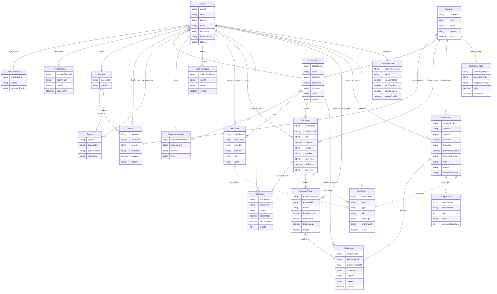
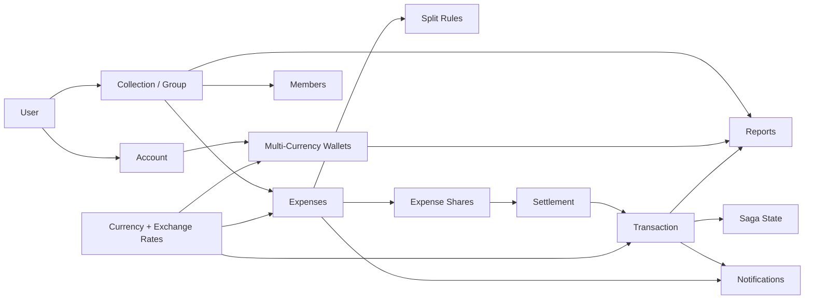

# 12 - Entity Relationship Map

## Recommended Drawing Method

Use a business-level Mermaid relationship map for presentation, then keep the database ER diagram as backup for technical questions.

This entity map is easier for investors and lecturers because it uses domain names instead of table names. It shows how MyPay concepts connect: users own wallets, join collections, split expenses, settle shares, and receive notifications.

## Full Business Entity Relationship Diagram

## Simplified Presentation Version

Use this smaller version when the audience is non-technical.

## How To Explain The Entity Map

Start from the user:

1. A user has credentials and one wallet account.
2. The wallet account can contain many currency wallets.
3. A user can create or join many collections.
4. A collection has members, invitations, and expenses.
5. Each expense is calculated using split rules.
6. Split rules produce expense shares.
7. Shares are settled through transactions.
8. Transactions are protected by saga state and idempotency.
9. Currency entities support wallet currencies, expense currencies, transaction currencies, and exchange rates.
10. Notifications and reports are generated from business events and aggregated data.

## Most Important Relationships To Mention

- `User -> Account -> Wallet`: this is the wallet ownership chain.
- `User -> CollectionMember -> Collection`: this is how groups and permissions work.
- `Collection -> Expense -> ExpenseShare`: this is the core split-expense flow.
- `ExpenseShare -> Settlement -> Transaction`: this is how debt becomes payment.
- `Transaction -> SagaState`: this is the technical reliability layer.
- `Currency -> Wallet/Expense/Transaction/ExchangeRate`: this is the multi-currency layer.
- `Notification.referenceId`: this links notifications to business events such as settlement, expense, or invitation.

## Entity Design Notes

- User data is owned by the auth service.
- Wallet data references users by ID, but does not physically join the auth database.
- Collection members and shares reference users by ID so the collection service owns group logic independently.
- Transaction records store payer and payee IDs, making transaction history queryable without joining user tables.
- Settlement records connect transactions back to expense shares and collections.
- Notification records use a flexible `referenceId` so different event types can reuse the same notification table.
