# 13 - Class Relationship Map

## Recommended Drawing Method

Use Mermaid `classDiagram` and `flowchart` diagrams inside markdown.

A single UML diagram containing every class in MyPay would be too crowded to understand. The easiest method is:

1. Start with a global layer map.
2. Then show class relationships service by service.
3. Explain the repeated Spring pattern once: Controller -> Service Interface -> Service Implementation -> Repository -> Entity.
4. Add separate diagrams for cross-service clients, messaging, split strategies, saga orchestration, and shared common classes.

This gives you a map that is understandable, drawable, and presentable.

## 1. Global Class Layer Map

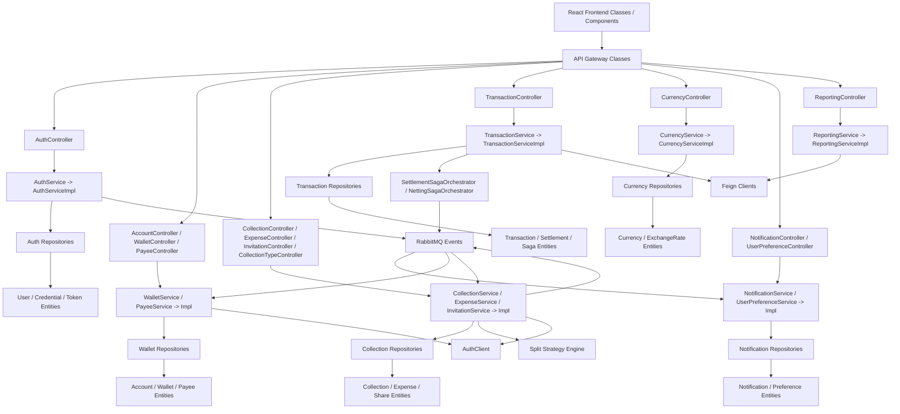

## Teacher Explanation Of The Global Map

Think of MyPay as a school with departments.

- The API Gateway is the front desk. Every frontend request comes here first.
- Controllers are reception counters inside each department. They receive HTTP requests.
- Service interfaces are the promises of what the department can do.
- Service implementations are the actual workers doing the business logic.
- Repositories are the filing cabinets. They read and write database records.
- Entities are the paper forms stored in those filing cabinets.
- Feign clients are phone calls to other departments.
- RabbitMQ is the notice board. One service posts an event, and other services react later.

The most common flow is:

```text
Frontend -> Gateway -> Controller -> Service -> Repository -> Entity/Database
```

For cross-service work, the flow becomes:

```text
Service A -> Feign Client or RabbitMQ -> Service B
```

## 2. API Gateway Classes

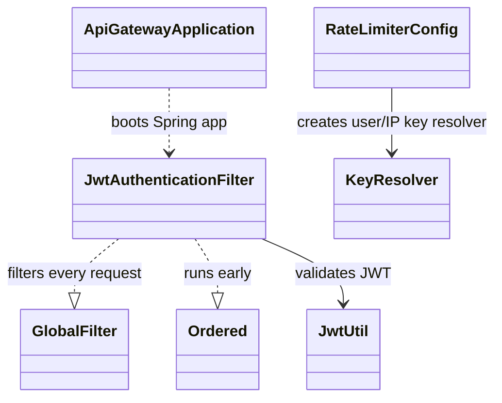

### Explanation

The gateway classes protect the entrance to the backend.

`JwtAuthenticationFilter` is the important class here. It checks whether a route is open, validates the JWT token, blocks external access to `/internal/` endpoints, and adds headers such as `X-User-Id`, `X-Trace-Id`, and `X-Request-Id`.

`RateLimiterConfig` tells Spring Cloud Gateway how to identify a caller for rate limiting. It uses the user ID when available, otherwise the IP address.

## 3. Auth Service Class Relationships

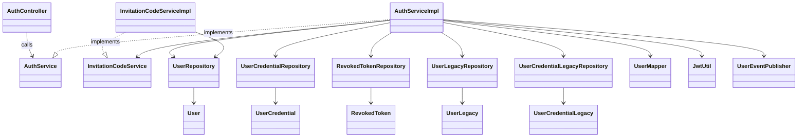

### Explanation

`AuthController` is the HTTP entry point for login, register, refresh, logout, profile, password, and account deletion.

`AuthService` is an interface. It says what auth can do. `AuthServiceImpl` is the real class that does it.

During registration:

1. `AuthController` calls `AuthService.register`.
2. `AuthServiceImpl` checks `UserRepository` to prevent duplicate email.
3. `InvitationCodeService` creates a unique invite code.
4. `UserRepository` saves `User`.
5. `UserCredentialRepository` saves password hash in `UserCredential`.
6. `JwtUtil` creates access and refresh tokens.
7. `UserEventPublisher` publishes `user.registered` to RabbitMQ.

During account deletion, `AuthServiceImpl` archives old data into `UserLegacy` and `UserCredentialLegacy` before deleting active records.

## 4. Wallet Service Class Relationships

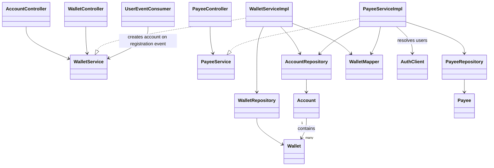

### Explanation

Wallet service handles the user's money containers.

There are three controllers:

- `AccountController` for account-level information.
- `WalletController` for wallet actions such as open, top up, debit, credit, and close.
- `PayeeController` for saved payees.

`WalletServiceImpl` uses `AccountRepository` and `WalletRepository` because accounts and wallets are tightly connected. One `Account` can have many `Wallet` objects.

`PayeeServiceImpl` uses `AuthClient` because a payee is another user. It must ask auth service whether that user exists.

`UserEventConsumer` listens to `user.registered`. When auth says a new user exists, wallet service creates that user's account.

## 5. Collection Service Class Relationships

```mermaid
classDiagram
  class CollectionController
  class ExpenseController
  class InvitationController
  class CollectionTypeController
  class CollectionService
  class CollectionServiceImpl
  class ExpenseService
  class ExpenseServiceImpl
  class InvitationService
  class InvitationServiceImpl
  class CollectionRepository
  class CollectionMemberRepository
  class CollectionTypeRepository
  class ExpenseRepository
  class ExpenseShareRepository
  class SplitRuleRepository
  class InvitationRepository
  class CollectionMapper
  class ExpenseMapper
  class InvitationMapper
  class AuthClient
  class NotificationEventPublisher
  class CollectionRoleAspect
  class RequireCollectionRole
  class Collection
  class CollectionMember
  class CollectionType
  class Expense
  class ExpenseShare
  class SplitRule
  class Invitation

  CollectionController --> CollectionService
  ExpenseController --> ExpenseService
  InvitationController --> InvitationService
  CollectionTypeController --> CollectionTypeRepository

  CollectionServiceImpl ..|> CollectionService
  ExpenseServiceImpl ..|> ExpenseService
  InvitationServiceImpl ..|> InvitationService

  CollectionServiceImpl --> CollectionRepository
  CollectionServiceImpl --> CollectionMemberRepository
  CollectionServiceImpl --> ExpenseRepository
  CollectionServiceImpl --> ExpenseShareRepository
  CollectionServiceImpl --> CollectionMapper
  CollectionServiceImpl --> AuthClient

  ExpenseServiceImpl --> CollectionRepository
  ExpenseServiceImpl --> CollectionMemberRepository
  ExpenseServiceImpl --> ExpenseRepository
  ExpenseServiceImpl --> ExpenseShareRepository
  ExpenseServiceImpl --> SplitRuleRepository
  ExpenseServiceImpl --> ExpenseMapper
  ExpenseServiceImpl --> NotificationEventPublisher

  InvitationServiceImpl --> CollectionRepository
  InvitationServiceImpl --> CollectionMemberRepository
  InvitationServiceImpl --> InvitationRepository
  InvitationServiceImpl --> InvitationMapper
  InvitationServiceImpl --> NotificationEventPublisher
  InvitationServiceImpl --> AuthClient

  CollectionRoleAspect --> RequireCollectionRole : checks annotated methods
  CollectionRoleAspect --> CollectionRepository
  CollectionRoleAspect --> CollectionMemberRepository

  CollectionRepository --> Collection
  CollectionMemberRepository --> CollectionMember
  CollectionTypeRepository --> CollectionType
  ExpenseRepository --> Expense
  ExpenseShareRepository --> ExpenseShare
  SplitRuleRepository --> SplitRule
  InvitationRepository --> Invitation

  Collection "1" --> "many" CollectionMember
  Collection "1" --> "many" Expense
  Collection "1" --> "many" Invitation
  Expense "1" --> "many" ExpenseShare
  Expense "1" --> "many" SplitRule
```

### Explanation

Collection service is the heart of shared expenses.

`CollectionController` manages groups. `ExpenseController` manages spending inside a group. `InvitationController` manages inviting members. `CollectionTypeController` manages categories/types.

The class flow looks like this:

```text
CollectionController -> CollectionService -> CollectionServiceImpl -> CollectionRepository
ExpenseController -> ExpenseService -> ExpenseServiceImpl -> ExpenseRepository / ExpenseShareRepository / SplitRuleRepository
InvitationController -> InvitationService -> InvitationServiceImpl -> InvitationRepository
```

`CollectionRoleAspect` is a special class. It watches methods annotated with `@RequireCollectionRole`. Before the method runs, it checks if the current user belongs to the collection and has enough permission.

This is like a classroom monitor at the door: before someone edits a collection, it checks whether they are allowed to enter that action.

## 6. Split Strategy Class Relationships

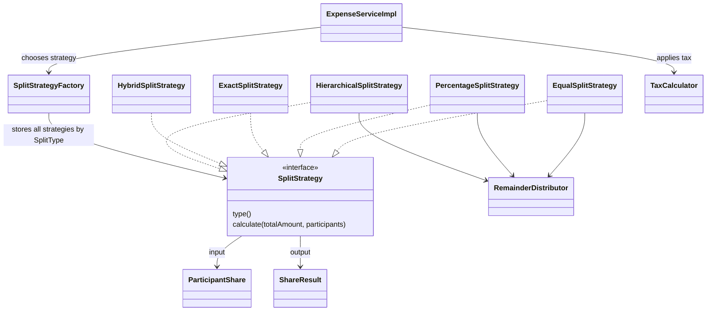

### Explanation

This is one of the cleanest examples of good code design in MyPay.

`SplitStrategy` is the common rule: every split method must say its type and calculate shares.

Each strategy is a different way to split:

- `EqualSplitStrategy`: everyone pays the same.
- `PercentageSplitStrategy`: each member has a percentage.
- `ExactSplitStrategy`: each member has a fixed amount.
- `HybridSplitStrategy`: some fixed amounts first, then split the remainder.
- `HierarchicalSplitStrategy`: uses weights, like primary/secondary responsibility.

`SplitStrategyFactory` is the selector. `ExpenseServiceImpl` does not need a huge `if else` block. It asks the factory: "Give me the strategy for this split type."

`RemainderDistributor` handles rounding leftovers. `TaxCalculator` adds tax logic.

## 7. Transaction Service Class Relationships

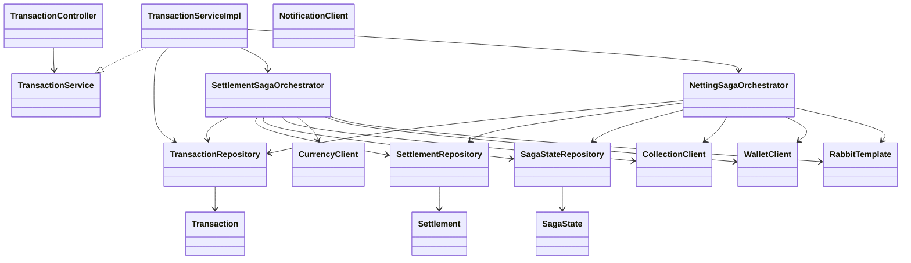

### Explanation

Transaction service is where money movement workflows are coordinated.

`TransactionController` receives requests such as top-up, settlement, netting, and history.

`TransactionServiceImpl` handles simpler transaction tasks and delegates complex workflows to orchestrators.

`SettlementSagaOrchestrator` is responsible for one share settlement:

1. Validate the share through `CollectionClient`.
2. Convert currency through `CurrencyClient` if needed.
3. Debit payer through `WalletClient`.
4. Credit payee through `WalletClient`.
5. Save `Transaction`, `Settlement`, and `SagaState`.
6. Publish notification events with `RabbitTemplate`.
7. Compensate if something fails halfway.

`NettingSagaOrchestrator` does a similar job, but it first calculates the final net amount between two users.

## 8. Currency Service Class Relationships

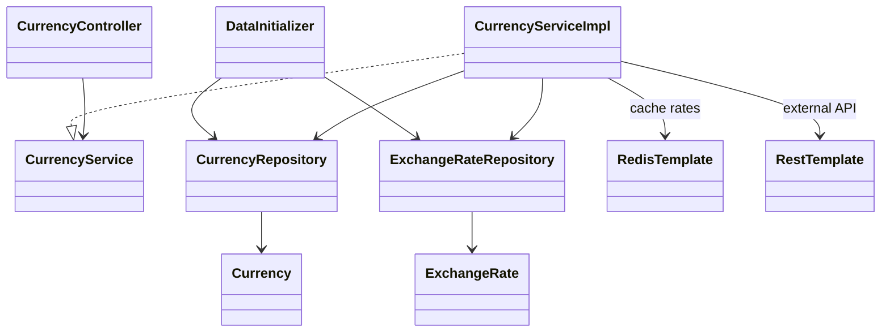

### Explanation

Currency service answers questions like:

- What currencies are supported?
- What is the exchange rate?
- How much is this amount after conversion?

`CurrencyServiceImpl` tries to resolve rates in this order:

1. Redis cache.
2. External exchange-rate API through `RestTemplate`.
3. Stored exchange-rate data through `ExchangeRateRepository`.
4. Hardcoded fallback rates.

That layered design keeps the app working even if one source fails.

## 9. Notification Service Class Relationships

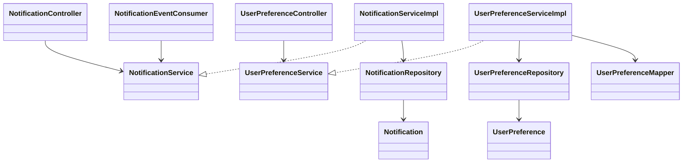

### Explanation

Notification service has two jobs:

1. Store and update user notifications.
2. Store notification preferences.

`NotificationEventConsumer` listens to RabbitMQ queues. When a settlement, expense, or invitation event arrives, it converts the event into a create-notification request and calls `NotificationService`.

So notification service is not manually called by every user screen. It reacts to events from other services.

## 10. Reporting Service Class Relationships

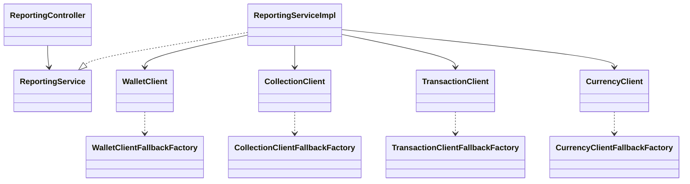

### Explanation

Reporting service is an aggregator. It does not own major business entities in the database. Instead, it asks other services for data.

For example, a dashboard report may need:

- Wallet data from wallet service.
- Collection data from collection service.
- Transaction data from transaction service.

`ReportingServiceImpl` uses Feign clients to call those services. It also uses fallback factories so the system can fail more gracefully when a dependency is unavailable.

## 11. Common Library Class Relationships

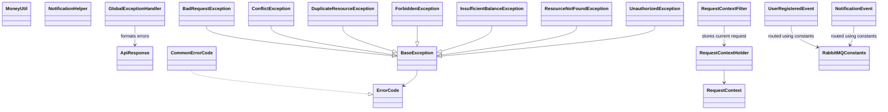

### Explanation

`common-lib` is shared code used by multiple services.

`ApiResponse` gives API responses a consistent shape.

`MoneyUtil` centralizes money math using `BigDecimal`.

`BaseException` and child exceptions standardize error handling.

`GlobalExceptionHandler` converts thrown exceptions into clean HTTP responses.

`RequestContextFilter`, `RequestContextHolder`, and `RequestContext` preserve request/user/trace information inside each service.

`UserRegisteredEvent`, `NotificationEvent`, and `RabbitMQConstants` standardize RabbitMQ messaging between services.

## 12. Cross-Service Communication Classes

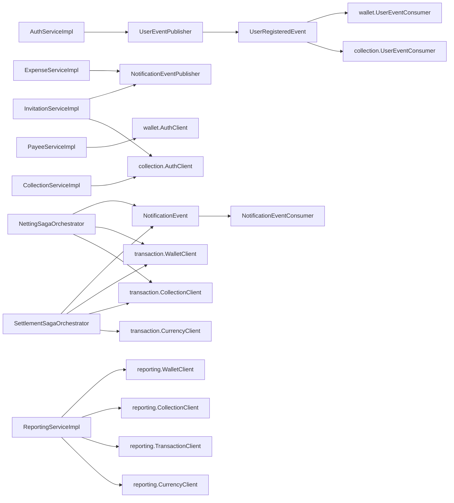

### Explanation

There are two kinds of service-to-service communication.

First, synchronous Feign calls:

- Wallet asks auth to resolve payee users.
- Collection asks auth to resolve members or invitees.
- Transaction asks wallet, collection, and currency services during settlement.
- Reporting asks wallet, collection, transaction, and currency services to build reports.

Second, asynchronous RabbitMQ events:

- Auth publishes `UserRegisteredEvent`.
- Wallet consumes it to create accounts.
- Collection consumes it to create default collection types.
- Collection and transaction publish `NotificationEvent`.
- Notification service consumes it and stores notification records.

Use this sentence in presentation:

"Feign is used when the answer is needed immediately. RabbitMQ is used when another service can react later."

## 13. How To Read The Whole Class Design

If you are explaining this to someone, use this order:

1. "Each service follows a Spring layered structure."
2. "Controllers receive HTTP requests."
3. "Service interfaces define capabilities."
4. "Service implementations contain business rules."
5. "Repositories save and load entities."
6. "Mappers convert entities into DTOs."
7. "Feign clients call other services."
8. "RabbitMQ publishers and consumers handle background events."
9. "Common-lib gives all services shared response, error, event, and money utilities."
10. "Special patterns appear where needed: split strategies for calculation, saga orchestrators for settlement reliability, and AOP for collection role checking."

## Most Important Class Relationships To Remember

- `AuthController -> AuthService -> AuthServiceImpl -> UserRepository -> User`
- `WalletController -> WalletService -> WalletServiceImpl -> WalletRepository -> Wallet`
- `CollectionController -> CollectionService -> CollectionServiceImpl -> CollectionRepository -> Collection`
- `ExpenseController -> ExpenseService -> ExpenseServiceImpl -> SplitStrategyFactory -> SplitStrategy`
- `TransactionController -> TransactionService -> TransactionServiceImpl -> SettlementSagaOrchestrator`
- `SettlementSagaOrchestrator -> WalletClient / CollectionClient / CurrencyClient`
- `NotificationEventConsumer -> NotificationService -> NotificationRepository -> Notification`
- `ReportingServiceImpl -> Feign Clients -> Other Services`
- `GlobalExceptionHandler -> ApiResponse`
- `BaseException -> specific exceptions`

## Short Teacher-Style Summary

MyPay is built like a set of small departments. Each department has the same internal structure: a controller receives the request, a service decides what should happen, repositories handle data, and entities represent saved records.

When one department needs another department immediately, it uses a Feign client. When it just needs to announce that something happened, it publishes a RabbitMQ event.

The special parts are what make the project interesting: the split strategy classes make expense calculation flexible, the saga orchestrator classes make settlement safer, the role aspect protects collection operations, and the common library keeps responses, errors, money math, request context, and events consistent across services.
